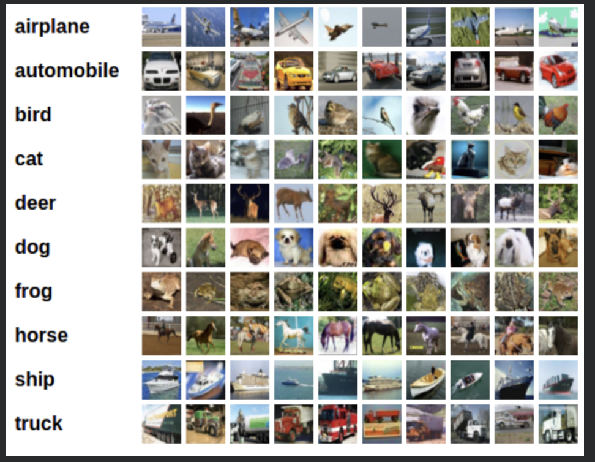
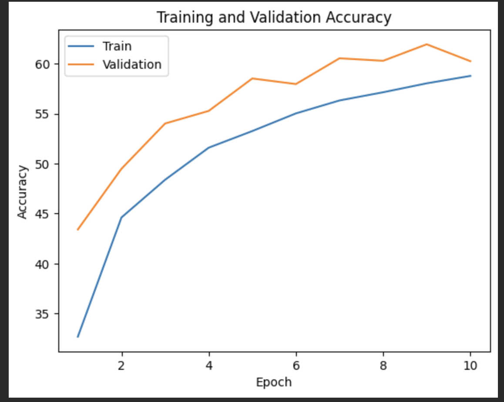
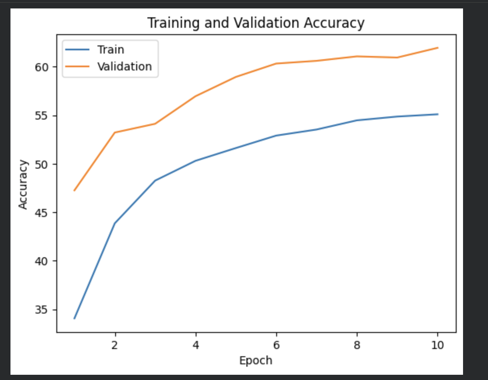
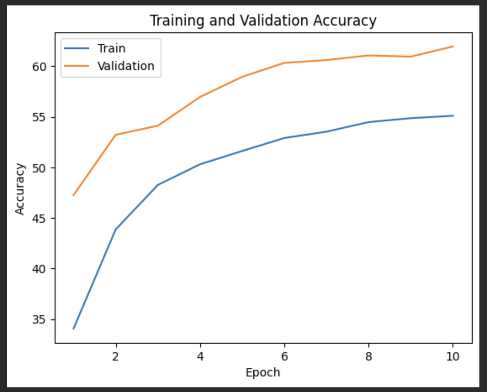

# CNN from Scratch — CIFAR-10 (PyTorch)

Three progressively improved CNN architectures built entirely from scratch
in PyTorch and benchmarked on the CIFAR-10 dataset.

The goal is to understand how each improvement — BatchNorm and residual
connections — actually changes training behaviour and final accuracy,
rather than just using a pretrained model off the shelf.

---

### What it does

- Builds 3 different CNN architectures from scratch — no pretrained weights
- Applies data augmentation: random crop and horizontal flip to reduce overfitting
- Trains each model for 10 epochs and records training + validation accuracy
- Plots learning curves for each model to compare convergence speed
- Shows clearly how BatchNorm stabilises training and how ResNet skip
  connections help deeper networks learn effectively

---

### Dataset

CIFAR-10 — downloaded automatically via torchvision. No manual download needed.

- 50,000 training images · 10,000 test images
- 10 object classes · 32×32 colour images
- Classes: airplane · car · bird · cat · deer · dog · frog · horse · ship · truck

**Sample images from CIFAR-10:**



---

### Architectures

**1. Vanilla CNN**

The baseline — two conv layers followed by three fully connected layers.
No normalisation, no skip connections.
Input (3×32×32)
→ Conv(3→6, 5×5) + ReLU + MaxPool(2×2)
→ Conv(6→16, 5×5) + ReLU + MaxPool(2×2)
→ Flatten
→ FC(400→120) + ReLU
→ FC(120→84) + ReLU
→ FC(84→10)
→ CrossEntropyLoss

**Accuracy curve:**



---

**2. CNN + BatchNorm**

Same architecture as vanilla CNN but with BatchNorm2d added after
each convolutional layer. BatchNorm normalises activations per batch,
which reduces internal covariate shift and allows faster, more stable training.
Input (3×32×32)
→ Conv(3→6, 5×5) + BatchNorm2d(6) + ReLU + MaxPool(2×2)
→ Conv(6→16, 5×5) + BatchNorm2d(16) + ReLU + MaxPool(2×2)
→ Flatten
→ FC(400→120) + ReLU
→ FC(120→84) + ReLU
→ FC(84→10)
→ CrossEntropyLoss

**Accuracy curve:**



---

**3. Custom ResNet**

A lightweight ResNet built from scratch using BasicBlock modules
with residual skip connections. Skip connections allow gradients to
flow directly through the network, solving the vanishing gradient
problem that makes deeper vanilla CNNs hard to train.
Input (3×32×32)
→ Conv(3→64, 7×7, stride=2) + BatchNorm + ReLU + MaxPool
→ BasicBlock × 2 (with residual skip connections)
→ Adaptive Average Pooling
→ FC(64→10)
→ CrossEntropyLoss

**Accuracy curve:**



---

### Training Setup
Loss function   CrossEntropyLoss
Optimizer       SGD (lr=0.001, momentum=0.9)
Epochs          10 per model
Batch size      4
Augmentation    RandomCrop(32, padding=4) + RandomHorizontalFlip
Normalisation   mean=[0.5, 0.5, 0.5], std=[0.5, 0.5, 0.5]
Device          GPU (cuda) if available, else CPU
Random seed     42

---

### Key Takeaways

- BatchNorm consistently improves convergence speed over vanilla CNN
- Residual connections allow the network to train more effectively
  even when deeper, by preserving gradient flow
- All three architectures are trained under identical conditions
  so the comparison is fair and controlled

---

### Stack

| | |
|---|---|
| **Framework** | PyTorch · torchvision |
| **Visualization** | Matplotlib · NumPy |
| **Language** | Python |

---

### Setup

```bash
# Install dependencies
pip install torch torchvision matplotlib numpy

# Run the notebook
jupyter notebook 2_CNN_from_Scratch.ipynb
```

The CIFAR-10 dataset will download automatically on first run.

---

